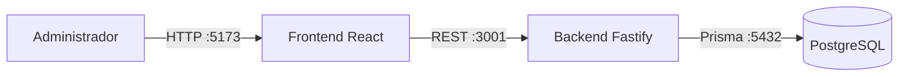
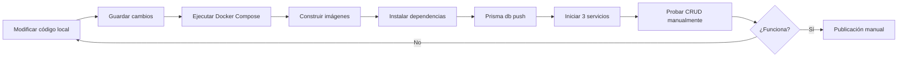
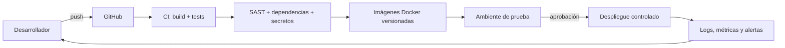
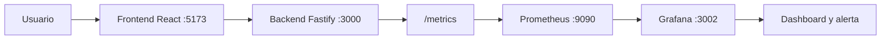

# Proyecto integrador DevOps

Evolución DevOps de un sistema web CRUD para la gestión de usuarios. La Fase 1 documenta el diagnóstico y la planificación; la Fase 2 incorpora versionamiento, pruebas automatizadas, contenedores e integración continua.

## Información académica

- **Estudiante:** Cristhian Alfredo Zambrano Zambrano
- **Docente:** Mg. Enrique Javier Macías Arias
- **Asignatura:** DevOps
- **Programa:** Maestría en Diseño Web y Desarrollo de Apps
- **Cohorte y paralelo:** II Cohorte - Paralelo A
- **Institución:** ESPAM MFL

## Sistema y contexto

El sistema permite consultar, crear, editar y eliminar usuarios, además de asignarles los roles `user`, `editor` o `admin`. Su objetivo es centralizar la administración básica de cuentas para personal administrativo de una institución educativa o pequeña organización. Los beneficiarios son administradores, personal de soporte y usuarios cuyos registros se mantienen en la plataforma.

| Capa | Tecnologías | Responsabilidad |
|---|---|---|
| Interfaz | React 18, TypeScript, Vite y Mantine | Formularios, tabla y consumo de la API REST |
| API | Node.js, Fastify, TypeScript y Prisma | Reglas del CRUD y acceso a datos |
| Datos | PostgreSQL 17 | Persistencia de usuarios |
| Ejecución | Docker y Docker Compose | Construcción y coordinación de los servicios |

### Arquitectura actual



## Flujo actual de trabajo

El diagnóstico toma como línea base la práctica recibida en archivos ZIP. No existe aún un pipeline de integración o entrega continua.



El detalle de responsables, evidencias, esperas y riesgos se encuentra en [docs/diagnostico-devops.md](docs/diagnostico-devops.md).

## Diagnóstico priorizado - línea base de la Fase 1

| Prioridad | Cuello de botella o riesgo | Causa | Impacto |
|---|---|---|---|
| Alta | Validación y despliegue manual | No existe pipeline CI/CD | Errores tardíos, dependencia humana y baja trazabilidad |
| Alta | Ausencia de pruebas automatizadas | El proyecto no incluye suites de prueba | Regresiones y retrabajo después de cada cambio |
| Alta | Riesgo en dependencias | `npm audit` reportó 2 hallazgos en frontend y 6 altos en backend | Exposición de la cadena de suministro |
| Alta | Configuración sensible | La práctica original incluía credenciales en `.env` y Compose | Posible publicación de secretos y accesos no autorizados |
| Media | Observabilidad inexistente | Solo existen logs básicos del backend | Incidentes detectados tarde y sin métricas de servicio |
| Media | Recuperación no definida | No hay rollback ni respaldo documentado | Mayor tiempo de recuperación ante fallos |

## Propuesta inicial DevOps

### Objetivo

Reducir errores manuales y hacer reproducible, segura y medible la entrega del CRUD mediante control de versiones, validaciones automáticas, gestión de configuración y retroalimentación operativa.

### Alcance

La primera adopción cubre repositorio, compilación, pruebas, análisis de seguridad, construcción de contenedores y despliegue controlado en un ambiente de prueba. Kubernetes queda fuera del alcance porque añadiría complejidad prematura para tres servicios.

### Arquitectura preliminar



### Roadmap de 90 días

| Periodo | Acción cultural | Acción de proceso | Acción técnica | Evidencia esperada |
|---|---|---|---|---|
| 0-30 días | Responsabilidad compartida sobre el servicio | Convención de ramas, commits y revisiones | CI para compilar frontend y backend; protección de secretos | Cada cambio genera resultado automático |
| 31-60 días | Revisión sin culpa de fallos | Definición de criterios de aceptación y rollback | Pruebas unitarias/API, auditoría de dependencias y SAST | Menos regresiones y vulnerabilidades visibles |
| 61-90 días | Revisión periódica de métricas | Despliegue pequeño y aprobado | Imágenes versionadas, ambiente de prueba y observabilidad | Entregas trazables y recuperación documentada |

### Métricas iniciales - línea base de la Fase 1

| Métrica | Línea base | Forma de medición | Meta inicial |
|---|---|---|---|
| Lead time de cambio | No medido | Tiempo entre commit y despliegue registrado por CI/CD | Obtener línea base en 30 días y reducirla al mes 3 |
| Frecuencia de despliegue | No registrada | Despliegues exitosos por mes | Al menos 2 despliegues controlados al mes |
| Tasa de fallos del cambio | No medida | Despliegues con rollback o corrección / total | Menor al 20 % después de establecer la línea base |
| Tiempo de recuperación | No medido | Tiempo entre incidente y restauración | Procedimiento medible y recuperación menor a 60 min |
| Cobertura de pruebas | 0 % / sin suite | Reporte del pipeline | Cobertura inicial mínima del 60 % en lógica crítica |

## Ejecución local

### Requisitos

- Git
- Docker Desktop con Docker Compose v2

### Configuración

```bash
git clone https://github.com/cazzSoft/proyecto-integrador-devops-fase1.git
cd proyecto-integrador-devops-fase1
cp .env.example .env
```

Cambie `POSTGRES_PASSWORD` en `.env` antes de iniciar el sistema. El archivo real está excluido del repositorio.

### Inicio y comprobación

```bash
docker compose up --build -d
docker compose ps
docker compose logs -f
```

- Frontend: <http://localhost:5173>
- Backend: <http://localhost:3001>
- Salud del backend: <http://localhost:3001/health>
- PostgreSQL: `localhost:5434`

Para detener los servicios sin eliminar datos:

```bash
docker compose down
```

## Endpoints principales

| Método | Ruta | Operación |
|---|---|---|
| GET | `/api/users` | Listar usuarios |
| GET | `/api/users/:id` | Consultar un usuario |
| POST | `/api/users` | Crear un usuario |
| PUT | `/api/users/:id` | Actualizar un usuario |
| DELETE | `/api/users/:id` | Eliminar un usuario |
| GET | `/health` | Verificar disponibilidad del backend |

## Práctica 1: flujo Git, Docker y CI/CD

La práctica se desarrolla en una rama corta y se integra mediante pull request después de aprobar los controles automáticos. El cambio funcional incorpora `GET /health`, cuya respuesta identifica el servicio y confirma su disponibilidad sin consultar la base de datos.

Las imágenes generadas por Docker Compose utilizan etiquetas identificables:

- `cazzsoft/gestion-usuarios-backend:practica1`
- `cazzsoft/gestion-usuarios-frontend:practica1`

Comprobación reproducible:

```bash
cd backend
npm ci
npm test
npm run build
cd ..
docker compose config
docker compose build
docker compose up -d
docker compose ps
curl http://localhost:3001/health
```

## Verificaciones realizadas

- `npm run build` en frontend: correcto.
- `npm run build` en backend: correcto.
- Auditoría de dependencias: 2 hallazgos en frontend y 6 de severidad alta en backend; registrados como riesgo y trabajo futuro.
- Los archivos `.env` reales están excluidos y existe una plantilla segura.
- La ejecución integral con Docker Compose fue comprobada en Docker Desktop.

## Pruebas automatizadas

El backend incluye pruebas de integración con Vitest y la inyección HTTP de Fastify. La suite verifica la creación de un usuario válido y el rechazo de una solicitud sin nombre.

```bash
cd backend
npm ci
npm test
npm run build
```

Para validar el frontend:

```bash
cd frontend
npm ci
npm run lint
npm run build
```

## Integración continua

El workflow `.github/workflows/ci.yml` se ejecuta en ramas `feat/**`, pull requests hacia `main` y cambios integrados en `main`. Sus controles son:

1. **Validar Backend:** dependencias, Prisma, pruebas y compilación.
2. **Validar Frontend:** dependencias, ESLint y compilación.
3. **Validar Docker:** configuración de Compose y construcción de imágenes.

La tercera etapa se ejecuta únicamente cuando las validaciones del backend y frontend terminan correctamente. El flujo recomendado utiliza una rama corta, pull request, revisión del pipeline e integración posterior a `main`.

Durante la validación local, ESLint detectó una variable declarada y no utilizada. Se eliminó la variable del bloque de captura y se repitieron los controles satisfactoriamente. Vitest también encontró una prueba compilada dentro de `dist`; se restringió la búsqueda a `src/**/*.test.ts` y se excluyeron las pruebas de la compilación de producción.

Prueba.. webhook
## Observabilidad con Prometheus y Grafana

La fase de observabilidad agrega un endpoint de metricas en el backend, recoleccion periodica con Prometheus y visualizacion en Grafana mediante un dashboard versionado en el repositorio.

### Arquitectura de observabilidad



### Endpoint de metricas

El backend expone metricas Prometheus en:

- Local desde el host: <http://localhost:3001/metrics>
- Interno en Docker Compose: `http://backend:3000/metrics`

Metricas principales:

| Metrica | Uso |
|---|---|
| `app_http_requests_total` | Contador de solicitudes HTTP por metodo, ruta y codigo de estado. |
| `app_http_request_duration_seconds` | Histograma de duracion de solicitudes para calcular percentiles como P95. |
| `app_process_resident_memory_bytes` | Memoria residente usada por el proceso Node.js. |
| `app_nodejs_heap_size_used_bytes` | Memoria heap usada por Node.js. |
| `app_process_cpu_seconds_total` | Tiempo acumulado de CPU usado por el proceso. |

### Levantar el stack completo

```bash
docker compose up --build -d
docker compose ps
```

Servicios de verificacion:

- Frontend: <http://localhost:5173>
- Backend: <http://localhost:3001>
- Salud del backend: <http://localhost:3001/health>
- Metricas del backend: <http://localhost:3001/metrics>
- Prometheus: <http://localhost:9090>
- Grafana: <http://localhost:3002>

Credenciales locales de Grafana:

- Usuario: `admin`
- Contrasena: `admin123`

> Estas credenciales son solo para laboratorio local. En produccion deben gestionarse como secretos.

### Prometheus

El archivo `observability/prometheus.yml` define dos jobs:

- `prometheus`: monitorea el propio servidor Prometheus.
- `backend`: recolecta `backend:3000/metrics` dentro de la red Docker.

Para validar los targets, abrir:

```text
http://localhost:9090/targets
```

El target `backend` debe aparecer en estado `UP`.

### Grafana

Grafana se aprovisiona automaticamente con:

- Datasource: `observability/grafana/provisioning/datasources/prometheus.yml`
- Dashboard provider: `observability/grafana/provisioning/dashboards/dashboards.yml`
- Dashboard JSON: `observability/grafana/dashboards/observabilidad-proyecto-integrador.json`
- Alerta de latencia P95: `observability/grafana/provisioning/alerting/backend-latency.yml`

El dashboard se llama **Observabilidad - Proyecto Integrador** e incluye:

1. Solicitudes HTTP por segundo.
2. Solicitudes por codigo HTTP.
3. Tiempo de respuesta P95.
4. Memoria utilizada por el backend.
5. CPU del backend.

### Generar trafico para evidencias

```powershell
1..30 | ForEach-Object { Invoke-WebRequest http://localhost:3001/health | Out-Null }
1..30 | ForEach-Object { Invoke-WebRequest http://localhost:3001/api/users | Out-Null }
```

Despues de unos segundos, Prometheus y Grafana deben mostrar datos activos.

### Integracion con Jenkins

El `Jenkinsfile` incluye la etapa **4. Observabilidad / Prometheus**, que valida `observability/prometheus.yml` con `promtool` antes de construir las imagenes Docker. Si el archivo tiene errores de sintaxis, el pipeline se detiene y evita publicar una configuracion de observabilidad invalida.

### Evidencias sugeridas

- Captura de `http://localhost:3001/metrics`.
- Captura de Prometheus con `backend` en estado `UP`.
- Captura del dashboard de Grafana con datos reales.
- Captura de la alerta aprovisionada en Grafana.
- Captura de Jenkins con la etapa **Observabilidad / Prometheus** aprobada.
- Archivo JSON del dashboard incluido en el repositorio.
