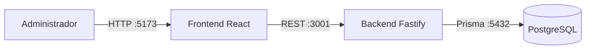
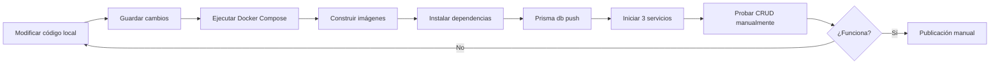
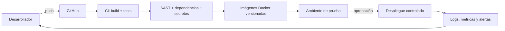

# Proyecto integrador DevOps - Fase 1

Diagnóstico y planificación DevOps de un sistema web CRUD para la gestión de usuarios.

[](#propuesta-inicial-devops)
[](frontend/)
[](backend/)
[](docker-compose.yml)

## Información académica

- **Estudiante:** Cristhian Alfredo Zambrano Zambrano
- **Docente:** Mg. Enrique Javier Macías Arias
- **Asignatura:** DevOps
- **Programa:** Maestría en Diseño Web y Desarrollo de Apps
- **Cohorte y paralelo:** II Cohorte - Paralelo A
- **Institución:** ESPAM MFL

## Sistema y contexto

El sistema permite consultar, crear, editar y eliminar usuarios, además de asignarles los roles `user`, `editor` o `admin`. Su objetivo es centralizar la administración básica de cuentas para personal administrativo de una institución educativa o pequeña organización. Los beneficiarios son administradores, personal de soporte y usuarios cuyos registros se mantienen en la plataforma.

| Capa | Tecnologías | Responsabilidad |
|---|---|---|
| Interfaz | React 18, TypeScript, Vite y Mantine | Formularios, tabla y consumo de la API REST |
| API | Node.js, Fastify, TypeScript y Prisma | Reglas del CRUD y acceso a datos |
| Datos | PostgreSQL 17 | Persistencia de usuarios |
| Ejecución | Docker y Docker Compose | Construcción y coordinación de los servicios |

### Arquitectura actual



## Flujo actual de trabajo

El diagnóstico toma como línea base la práctica recibida en archivos ZIP. No existe aún un pipeline de integración o entrega continua.



El detalle de responsables, evidencias, esperas y riesgos se encuentra en [docs/diagnostico-devops.md](docs/diagnostico-devops.md).

## Diagnóstico priorizado

| Prioridad | Cuello de botella o riesgo | Causa | Impacto |
|---|---|---|---|
| Alta | Validación y despliegue manual | No existe pipeline CI/CD | Errores tardíos, dependencia humana y baja trazabilidad |
| Alta | Ausencia de pruebas automatizadas | El proyecto no incluye suites de prueba | Regresiones y retrabajo después de cada cambio |
| Alta | Riesgo en dependencias | `npm audit` reportó 2 hallazgos en frontend y 6 altos en backend | Exposición de la cadena de suministro |
| Alta | Configuración sensible | La práctica original incluía credenciales en `.env` y Compose | Posible publicación de secretos y accesos no autorizados |
| Media | Observabilidad inexistente | Solo existen logs básicos del backend | Incidentes detectados tarde y sin métricas de servicio |
| Media | Recuperación no definida | No hay rollback ni respaldo documentado | Mayor tiempo de recuperación ante fallos |

## Propuesta inicial DevOps

### Objetivo

Reducir errores manuales y hacer reproducible, segura y medible la entrega del CRUD mediante control de versiones, validaciones automáticas, gestión de configuración y retroalimentación operativa.

### Alcance

La primera adopción cubre repositorio, compilación, pruebas, análisis de seguridad, construcción de contenedores y despliegue controlado en un ambiente de prueba. Kubernetes queda fuera del alcance porque añadiría complejidad prematura para tres servicios.

### Arquitectura preliminar



### Roadmap de 90 días

| Periodo | Acción cultural | Acción de proceso | Acción técnica | Evidencia esperada |
|---|---|---|---|---|
| 0-30 días | Responsabilidad compartida sobre el servicio | Convención de ramas, commits y revisiones | CI para compilar frontend y backend; protección de secretos | Cada cambio genera resultado automático |
| 31-60 días | Revisión sin culpa de fallos | Definición de criterios de aceptación y rollback | Pruebas unitarias/API, auditoría de dependencias y SAST | Menos regresiones y vulnerabilidades visibles |
| 61-90 días | Revisión periódica de métricas | Despliegue pequeño y aprobado | Imágenes versionadas, ambiente de prueba y observabilidad | Entregas trazables y recuperación documentada |

### Métricas iniciales

| Métrica | Línea base | Forma de medición | Meta inicial |
|---|---|---|---|
| Lead time de cambio | No medido | Tiempo entre commit y despliegue registrado por CI/CD | Obtener línea base en 30 días y reducirla al mes 3 |
| Frecuencia de despliegue | No registrada | Despliegues exitosos por mes | Al menos 2 despliegues controlados al mes |
| Tasa de fallos del cambio | No medida | Despliegues con rollback o corrección / total | Menor al 20 % después de establecer la línea base |
| Tiempo de recuperación | No medido | Tiempo entre incidente y restauración | Procedimiento medible y recuperación menor a 60 min |
| Cobertura de pruebas | 0 % / sin suite | Reporte del pipeline | Cobertura inicial mínima del 60 % en lógica crítica |

## Ejecución local

### Requisitos

- Git
- Docker Desktop con Docker Compose v2

### Configuración

```bash
git clone https://github.com/cazzSoft/proyecto-integrador-devops-fase1.git
cd proyecto-integrador-devops-fase1
cp .env.example .env
```

Cambie `POSTGRES_PASSWORD` en `.env` antes de iniciar el sistema. El archivo real está excluido del repositorio.

### Inicio y comprobación

```bash
docker compose up --build -d
docker compose ps
docker compose logs -f
```

- Frontend: <http://localhost:5173>
- Backend: <http://localhost:3001>
- PostgreSQL: `localhost:5434`

Para detener los servicios sin eliminar datos:

```bash
docker compose down
```

## Endpoints principales

| Método | Ruta | Operación |
|---|---|---|
| GET | `/api/users` | Listar usuarios |
| GET | `/api/users/:id` | Consultar un usuario |
| POST | `/api/users` | Crear un usuario |
| PUT | `/api/users/:id` | Actualizar un usuario |
| DELETE | `/api/users/:id` | Eliminar un usuario |

## Verificaciones realizadas

- `npm run build` en frontend: correcto.
- `npm run build` en backend: correcto.
- Auditoría de dependencias: 2 hallazgos en frontend y 6 de severidad alta en backend; registrados como riesgo y trabajo futuro.
- Los archivos `.env` reales están excluidos y existe una plantilla segura.
- La ejecución integral con Docker Compose debe comprobarse en un equipo con Docker Desktop.

## Entregable

La entrega incluye:

- [Informe final en PDF](docs/Proyecto_Integrador_DevOps_Fase_1.pdf), listo para subir a Moodle.
- [Copia editable en Word](docs/Proyecto_Integrador_DevOps_Fase_1.docx), para realizar ajustes posteriores.
